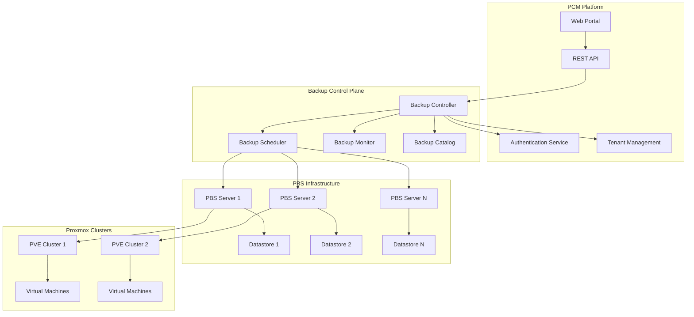
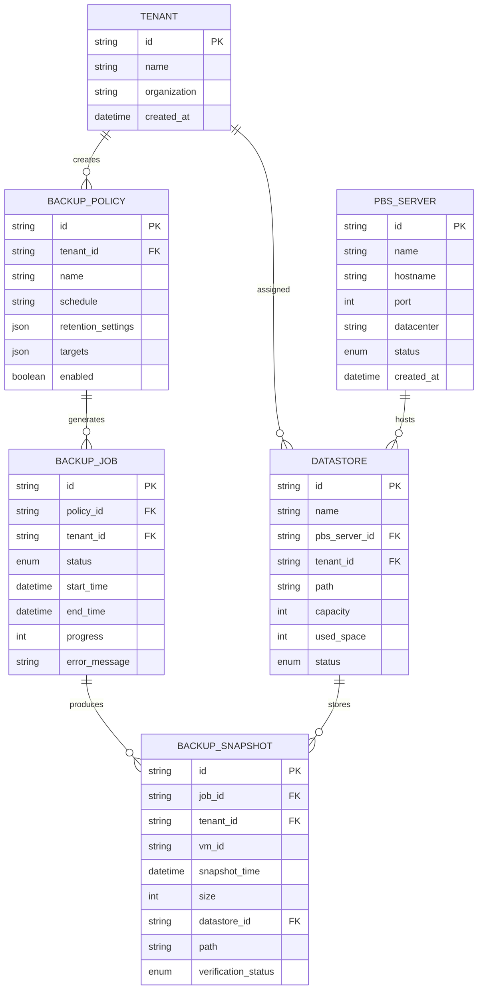

# Design Document: PCM Backup Module

## Overview

The PCM Backup Module provides native Proxmox Backup Server (PBS) integration for multi-tenant Backup-as-a-Service capabilities within the Proxmox Center Manager (PCM) platform. This module enables tenants to manage their backup operations through PCM while maintaining complete isolation and leveraging PBS as the backend engine.

### Key Design Goals

- **Multi-tenancy**: Complete isolation of backup data and operations between tenants
- **Scalability**: Support for multiple PBS servers across datacenters
- **Automation**: Policy-driven backup scheduling and execution
- **Self-service**: Web portal and API for tenant backup management
- **High Availability**: Resilient architecture with failover capabilities
- **Compliance**: Comprehensive audit logging and data protection

### System Context

The PCM Backup Module operates as a control plane that orchestrates backup operations across multiple PBS servers while providing tenant isolation and management capabilities. It integrates with the existing PCM platform for authentication, authorization, and multi-tenant resource management.

## Architecture

### High-Level Architecture



### Component Architecture

The system follows a layered architecture with clear separation of concerns:

1. **Presentation Layer**: Web portal and REST API for user interaction
2. **Control Layer**: Backup control plane managing policies and orchestration
3. **Execution Layer**: PBS servers performing actual backup operations
4. **Storage Layer**: Datastores providing backup data persistence

### Multi-Tenant Isolation Strategy

Tenant isolation is achieved through multiple mechanisms:

- **Datastore Segregation**: Each tenant is assigned dedicated datastores
- **Access Control**: Role-based permissions enforced at all layers
- **Network Isolation**: Separate PBS namespaces where supported
- **Audit Separation**: Tenant-specific audit logs and monitoring

## Components and Interfaces

### Backup Control Plane

The central orchestration component responsible for:

- PBS server registration and health monitoring
- Tenant isolation enforcement
- Backup policy management and validation
- Cross-datacenter coordination

**Key Interfaces:**
- `BackupController`: Main orchestration interface
- `TenantIsolationManager`: Enforces multi-tenant security
- `PBSServerManager`: Manages PBS server connections
- `PolicyEngine`: Validates and executes backup policies

### Backup Scheduler

Handles automated execution of backup jobs:

- Policy-driven scheduling
- Job queuing and resource management
- Retry logic and failure handling
- Overlap prevention

**Key Interfaces:**
- `SchedulerEngine`: Core scheduling logic
- `JobQueue`: Manages backup job execution order
- `ResourceManager`: Prevents resource conflicts
- `RetryHandler`: Implements failure recovery

### Backup Monitor

Provides real-time monitoring and alerting:

- Job status tracking and progress monitoring
- Performance metrics collection
- Health status monitoring
- Alert generation and notification

**Key Interfaces:**
- `JobMonitor`: Tracks individual backup jobs
- `PerformanceCollector`: Gathers system metrics
- `AlertManager`: Handles notifications and alerts
- `HealthChecker`: Monitors component health

### Backup Catalog

Maintains comprehensive backup metadata:

- Backup history and relationships
- Search and filtering capabilities
- Verification status tracking
- Cross-datacenter metadata replication

**Key Interfaces:**
- `CatalogManager`: Main catalog operations
- `MetadataStore`: Persistent storage interface
- `SearchEngine`: Backup discovery and filtering
- `ReplicationManager`: Cross-datacenter sync

### Configuration Management

Handles backup policy configuration:

- Policy parsing and validation
- Configuration serialization
- Schema enforcement
- Version management

**Key Interfaces:**
- `ConfigurationParser`: Parses policy configurations
- `ConfigurationSerializer`: Serializes policy objects
- `SchemaValidator`: Validates configuration syntax
- `VersionManager`: Handles configuration versioning

## Data Models

### Core Entities

#### PBS Server
```python
class PBSServer:
    id: str
    name: str
    hostname: str
    port: int
    datacenter: str
    status: ServerStatus
    credentials: AuthCredentials
    datastores: List[Datastore]
    created_at: datetime
    updated_at: datetime
```

#### Datastore
```python
class Datastore:
    id: str
    name: str
    pbs_server_id: str
    tenant_id: str
    path: str
    capacity: int
    used_space: int
    status: DatastoreStatus
    created_at: datetime
```

#### Backup Policy
```python
class BackupPolicy:
    id: str
    tenant_id: str
    name: str
    description: str
    schedule: CronExpression
    retention: RetentionSettings
    targets: List[BackupTarget]
    enabled: bool
    created_at: datetime
    updated_at: datetime
```

#### Backup Job
```python
class BackupJob:
    id: str
    policy_id: str
    tenant_id: str
    status: JobStatus
    start_time: datetime
    end_time: Optional[datetime]
    progress: int
    error_message: Optional[str]
    backup_size: Optional[int]
    verification_status: VerificationStatus
```

#### Backup Snapshot
```python
class BackupSnapshot:
    id: str
    job_id: str
    tenant_id: str
    vm_id: str
    snapshot_time: datetime
    size: int
    datastore_id: str
    path: str
    verification_status: VerificationStatus
    retention_date: datetime
```

### Relationship Model



### Configuration Schema

#### Backup Policy Configuration
```json
{
  "type": "object",
  "properties": {
    "name": {"type": "string", "minLength": 1},
    "description": {"type": "string"},
    "schedule": {
      "type": "object",
      "properties": {
        "cron": {"type": "string", "pattern": "^[0-9\\*\\-\\,\\/\\s]+$"},
        "timezone": {"type": "string"}
      },
      "required": ["cron"]
    },
    "retention": {
      "type": "object",
      "properties": {
        "daily": {"type": "integer", "minimum": 0},
        "weekly": {"type": "integer", "minimum": 0},
        "monthly": {"type": "integer", "minimum": 0},
        "yearly": {"type": "integer", "minimum": 0}
      }
    },
    "targets": {
      "type": "array",
      "items": {
        "type": "object",
        "properties": {
          "vm_id": {"type": "string"},
          "cluster_id": {"type": "string"},
          "datastore_id": {"type": "string"}
        },
        "required": ["vm_id", "cluster_id", "datastore_id"]
      }
    },
    "options": {
      "type": "object",
      "properties": {
        "compression": {"type": "string", "enum": ["none", "lz4", "zstd"]},
        "encryption": {"type": "boolean"},
        "verification": {"type": "boolean"}
      }
    }
  },
  "required": ["name", "schedule", "retention", "targets"]
}
```